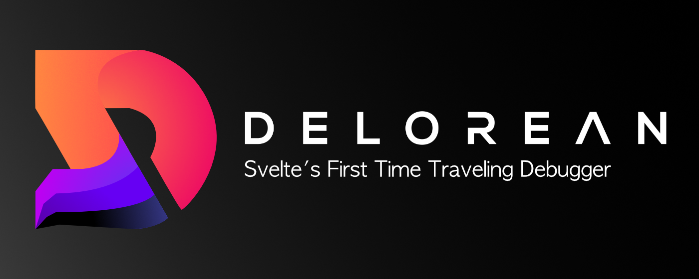
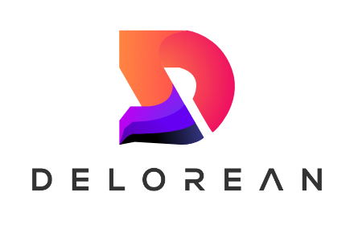

# DeLorean
The first time-traveling debugger for Svelte applications.

DeLorean is a debugging tool for Svelte developers. It records snapshots when a target applications's state changes and allows users to jump to any previously recorded state. It also displays the names and values of all variables in your application at the time of the snapshot alongside the state jump button.

## Features

#### Dev tool information panel
DeLorean features a clean, minimal UI that's easily accessible from within the Chrome developer tools panel. It displays the names of each component and the names of all variables that component contains. Each variable displays its value at whatever point in time you are examining.

#### Application state time-travel
By simply clicking on one of the state buttons, DeLorean will display the state information of the entire app at the point in time that it was captured. In addition to displaying component and variable information, DeLorean resets your application's state to the values it contained at any point since DeLorean was connected to your application. This allows for step-by-step examination of state change sequences within an application, easing the challenge of tracking state changes over time and reducing the need for ```console.log```s.

## Installation
At this time, DeLorean is undergoing standard Chrome extension code review in the Chrome Web Store. When that is complete, installation will be as easy as navigating to the DeLorean page in the Web Store and clicking install. From there it will be available in your Chrome developer tools panel. 

Until then, to install DeLorean simply navigate to the [DeLorean GitHub page](https://github.com/oslabs-beta/DeLorean). If you're interested in learning more about how DeLorean works, feel free to clone the repo! Otherwise, just download the ```chrome_extension``` folder and save it somewhere on your computer. 

Then navigate to [Chrome's extensions page](chrome://extensions/). Ensure you are in developer mode by clicking the 'developer mode' switch in the top-right corner of the page. Click on 'load unpacked', and select the ```chrome_extension``` folder downloaded earlier. Open up your DevTools panel, and check to make sure DeLorean is available in the dropdown menu of the navbar!

## How To Use

#### Run the target app in dev mode
Importantly, this debugging tool can only operate on Svelte applications being run in dev mode. Without dev mode enabled, Svelte's internal compiler strips some internal functionality to reduce overall bundle size. DeLorean requires that functionality, so ensure dev mode is enabled when you run tehe application to be tested.

#### Attach your Svelte app to an element with the id "root"
At this time, DeLorean searches the tested application for an id of "root" to find Svelte components to test. An example format for an html page and its main svelte component:

index.html:
```
<head></head>
<body>
  <div id="root" />
</body>
```
main.js:
```
import SvelteApp from './SvelteApp.svelte';

new SvelteApp({
  target: document.getElementById('root'),
});
```
If your application attaches to something other than an element with the id "root", DeLorean won't be able to find it.

#### Run the application from localhost*
This extension's permissions are scoped to ```localhost:<PORT>``` urls only, so make sure to run your application on a localhost port in order to use DeLorean.

#### Click Connect
Once your app is up and running, open the Dev Tools panel and select DeLorean from the dropdown in the navbar. Then click connect, and you should see your application's intial state.

#### Make some state changes, then click the state buttons
Have fun! DeLorean tracks every stateful update and reflects it in real time in the Dev Tool panel. If you click on the state buttons that appear in the Dev Tool panel, you will see your application's state at that moment reflected in the application, as well as each component's variables with their names and values displayed in the devtool.

Changing state after clicking on a previous state button will lead to the creation of a memory stack. This erases the old changes made to your application's state and allows you to explore a different sequence of state changes on your application, without needing to reresh or restart your application.



## Troubleshooting

#### DeLorean doesn't appear in the Dev Tools panel

[] Did you [install DeLorean](#installation)?

[] Try refreshing the extension from the [Chrome extensions page](chrome://extensions/)

#### DeLorean isn't communicating with my app

[] Is your application running in dev mode?

[] Is your Svelte component attached to an element with the id of "root"?

[] Are you running your app from something other than a localhost url?

[] Was your app developed with SvelteKit? At this time, DeLorean is untested with SvelteKit applications, and there are likely to be implementation issues. If you want DeLorean to work with SveleteKit now, feel free to [contribute](#contribute) to the project!

#### DeLorean is showing a blank screen after closing the Dev Tools panel

[] DeLorean receives initial state after connecting for the first time. If you've closed and reopened the Dev Tools panel, just click Connect and change some state in your application and DeLorean will start to track it, although only from the point of second connection onwards.

## Contribute

DeLorean is fully open-source, and we would love to get more brains working on the project. If you'd like to fix bugs or add a new feature, fork the repo, make some changes and submit a pull request. Our team will review your changes and work to integrate functional code. 

We have a number of features in our backlog to implement, including consistent SvelteKit integration, creation of an ignore list to stop tracking certain variables, and persistent storage, so that state history can be saved even after closing out of the extension.

If you have a feature request in mind, please submit an issue so our team can determine if it is an appropriate feature for DeLorean.

## Learn More

[DeLorean -- Svelte's Very First Time-Travelling Debugger](https://www.youtube.com/watch?v=FWG3Dfss3Jc)

Special thanks to RedHatter's [Svelte Dev Tools](https://github.com/RedHatter/svelte-devtools) for providing examples of how Svelte's dev mode listeners can be utilized.

## Contributors

**Albert Han** - [@alberthan1](https://github.com/alberthan1)

**Aram Krakirian** - [@aramkrakirian](https://github.com/aramkrakirian)

**Erick Maese** - [@ErickMaese](https://github.com/ErickMaese)

**Trevor Leung** - [@trevleung](https://github.com/trevleung)

**Sam VanTassel** - [@SamVanTassel](https://github.com/SamVanTassel)
